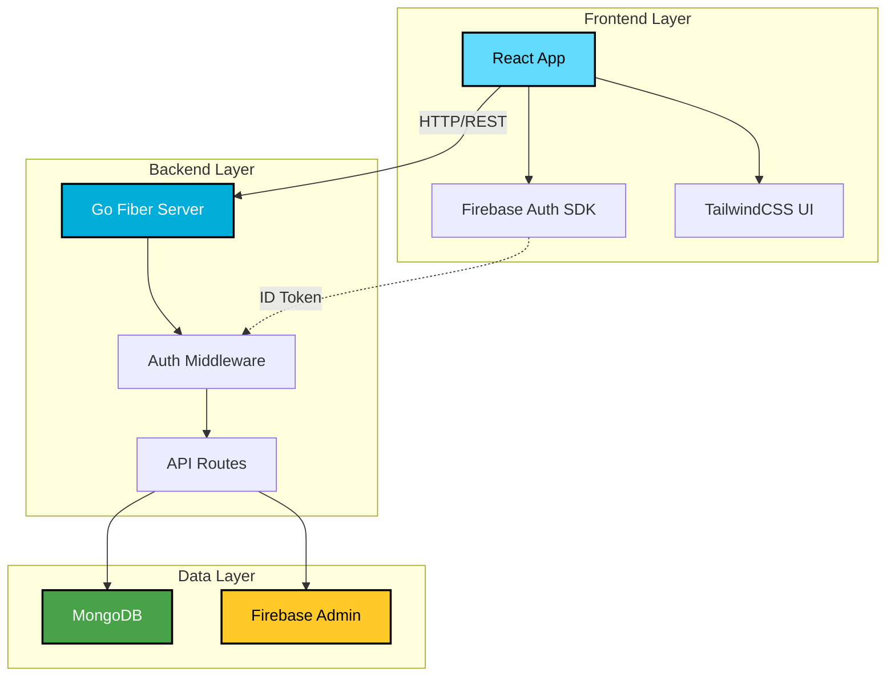

<div align="center">

# 💰 Split-It

### Smart Expense Splitting Made Simple

A modern, full-stack expense splitting application with real-time synchronization, intelligent debt simplification, and seamless group management.

[](https://go.dev/)
[](https://reactjs.org/)
[](https://www.mongodb.com/)
[](https://firebase.google.com/)

</div>

---

## 🌟 Overview

Split-It is a comprehensive expense tracking and splitting application designed for groups, roommates, trips, and shared expenses. Built with performance and user experience in mind, it features a blazing-fast **Golang backend** and a beautiful **React frontend**.

### ✨ Key Features

- 🔐 **Secure Authentication** - Firebase-powered email/password authentication
- 👥 **Group Management** - Create and manage multiple expense groups
- 💸 **Smart Expense Tracking** - Add, edit, and delete expenses with ease
- 🧮 **Debt Simplification** - Intelligent algorithm to minimize settlement transactions
- ⚡ **High Performance** - Go backend ensures lightning-fast response times
- 📱 **Responsive Design** - Beautiful UI built with TailwindCSS and Shadcn/ui
- 🔒 **Enterprise Security** - JWT verification, CORS, rate limiting, and security headers
- 📊 **Real-time Summaries** - Instant balance calculations and settlement suggestions

---

## 🏗️ Architecture



---

## 📁 Project Structure

```
Split-It/
├── backend/                    # Golang API Server
│   ├── config/                 # Configuration modules
│   │   ├── database.go        # MongoDB connection setup
│   │   └── firebase.go        # Firebase Admin SDK initialization
│   ├── middleware/            # HTTP middleware
│   │   └── auth.go           # JWT token verification
│   ├── models/               # Data models
│   │   ├── user.go          # User schema and operations
│   │   └── group.go         # Group and expense schemas
│   ├── routes/              # API route handlers
│   │   ├── users.go        # User endpoints
│   │   └── groups.go       # Group and expense endpoints
│   ├── main.go             # Application entry point
│   ├── go.mod              # Go module dependencies
│   └── .env                # Environment configuration
│
└── frontend/               # React Application
    ├── src/
    │   ├── components/    # Reusable UI components
    │   ├── pages/        # Page components
    │   ├── services/     # API service layer
    │   └── utils/        # Utility functions
    ├── public/           # Static assets
    └── package.json      # Node dependencies
```

---

## 🚀 Quick Start

### Prerequisites

Before you begin, ensure you have the following installed:

- **Go 1.21+** - [Download](https://go.dev/dl/)
- **Node.js 18+** - [Download](https://nodejs.org/)
- **MongoDB** - [Local](https://www.mongodb.com/try/download/community) or [Atlas](https://www.mongodb.com/cloud/atlas)
- **Firebase Project** - [Create one](https://console.firebase.google.com/)

### 🔧 Backend Setup

1. **Navigate to backend directory**
   ```bash
   cd backend
   ```

2. **Install Go dependencies**
   ```bash
   go mod download
   ```

3. **Configure Firebase**
   - Go to [Firebase Console](https://console.firebase.google.com/)
   - Navigate to **Project Settings** → **Service Accounts**
   - Click **Generate New Private Key**
   - Save the JSON file as `backend/firebase-service-account.json`

4. **Set up environment variables**
   
   Create or edit `backend/.env`:
   ```env
   PORT=5000
   MONGODB_URI=mongodb://localhost:27017/expense-tracker
   FIREBASE_SERVICE_ACCOUNT_PATH=./firebase-service-account.json
   CLIENT_URL=http://localhost:3000
   NODE_ENV=development
   ```

5. **Start the server**
   ```bash
   # Development mode
   go run main.go
   
   # Or build and run
   go build -o split-it-backend
   ./split-it-backend
   
   # With live reload (optional)
   go install github.com/cosmtrek/air@latest
   air
   ```

   ✅ Health check: `http://localhost:5000/health`

### 🎨 Frontend Setup

1. **Navigate to frontend directory**
   ```bash
   cd frontend
   ```

2. **Install dependencies**
   ```bash
   npm install
   # or
   yarn install
   ```

3. **Configure Firebase**
   
   Create `frontend/.env`:
   ```env
   REACT_APP_API_URL=http://localhost:5000
   REACT_APP_FIREBASE_API_KEY=your_api_key
   REACT_APP_FIREBASE_AUTH_DOMAIN=your_project.firebaseapp.com
   REACT_APP_FIREBASE_PROJECT_ID=your_project_id
   REACT_APP_FIREBASE_STORAGE_BUCKET=your_project.appspot.com
   REACT_APP_FIREBASE_MESSAGING_SENDER_ID=your_sender_id
   REACT_APP_FIREBASE_APP_ID=your_app_id
   ```

4. **Start the development server**
   ```bash
   npm start
   # or
   yarn start
   ```

   🌐 Opens at: `http://localhost:3000`

### 🎯 Running Both Servers

**Terminal 1 (Backend):**
```bash
cd backend && go run main.go
```

**Terminal 2 (Frontend):**
```bash
cd frontend && npm start
```

Then navigate to `http://localhost:3000` in your browser! 🎉

---

## 📡 API Documentation

### Base URL
```
http://localhost:5000
```

### Authentication

All protected endpoints require a Firebase ID token in the Authorization header:
```http
Authorization: Bearer <firebase-id-token>
```

### Endpoints

#### Health Check
```http
GET /health
```
Returns server health status.

---

#### User Endpoints

| Method | Endpoint | Description | Auth Required |
|--------|----------|-------------|---------------|
| `POST` | `/api/users/profile` | Get or create user profile | ✅ |
| `PUT` | `/api/users/profile` | Update user profile | ✅ |

**Example: Get/Create Profile**
```bash
curl -X POST http://localhost:5000/api/users/profile \
  -H "Authorization: Bearer <token>" \
  -H "Content-Type: application/json"
```

---

#### Group Endpoints

| Method | Endpoint | Description | Auth Required |
|--------|----------|-------------|---------------|
| `GET` | `/api/groups` | List all user's groups | ✅ |
| `GET` | `/api/groups/:id` | Get single group details | ✅ |
| `POST` | `/api/groups` | Create new group | ✅ |
| `PUT` | `/api/groups/:id` | Update group | ✅ |
| `DELETE` | `/api/groups/:id` | Delete group | ✅ |

**Example: Create Group**
```bash
curl -X POST http://localhost:5000/api/groups \
  -H "Authorization: Bearer <token>" \
  -H "Content-Type: application/json" \
  -d '{
    "name": "Weekend Trip",
    "members": [
      {"id": "1", "name": "Alice"},
      {"id": "2", "name": "Bob"}
    ]
  }'
```

---

#### Expense Endpoints

| Method | Endpoint | Description | Auth Required |
|--------|----------|-------------|---------------|
| `POST` | `/api/groups/:id/expenses` | Add expense to group | ✅ |
| `DELETE` | `/api/groups/:id/expenses/:expenseId` | Delete expense | ✅ |

**Example: Add Expense**
```bash
curl -X POST http://localhost:5000/api/groups/abc123/expenses \
  -H "Authorization: Bearer <token>" \
  -H "Content-Type: application/json" \
  -d '{
    "description": "Dinner",
    "amount": 120.50,
    "paidBy": "1",
    "participants": ["1", "2", "3"]
  }'
```

---

## 🗄️ Database Schema

### Users Collection

```javascript
{
  _id: ObjectId,
  firebaseUid: String,      // Firebase user ID
  email: String,            // User email
  name: String,             // Display name
  createdAt: Date,
  updatedAt: Date
}
```

### Groups Collection

```javascript
{
  _id: ObjectId,
  id: String,               // Unique group ID
  name: String,             // Group name
  userId: String,           // Owner's Firebase UID
  members: [
    {
      id: String,           // Member ID
      name: String          // Member name
    }
  ],
  expenses: [
    {
      id: String,           // Expense ID
      description: String,  // What was purchased
      amount: Number,       // Total amount
      paidBy: String,       // Member ID who paid
      participants: [String], // Member IDs who share
      date: Date            // When expense occurred
    }
  ],
  createdAt: Date,
  updatedAt: Date
}
```

---

## 🛠️ Tech Stack

### Backend (Golang)

| Technology | Purpose |
|------------|---------|
| **Go 1.21+** | Programming language |
| **Fiber v2** | High-performance web framework |
| **MongoDB Driver** | Database operations |
| **Firebase Admin SDK** | Authentication & user management |
| **godotenv** | Environment configuration |

### Frontend (React)

| Technology | Purpose |
|------------|---------|
| **React 18** | UI framework |
| **CRACO** | Create React App configuration |
| **TailwindCSS** | Utility-first CSS framework |
| **Shadcn/ui** | Beautiful component library |
| **Firebase SDK** | Client-side authentication |

---

## 🔨 Development Commands

### Backend

```bash
# Run development server
go run main.go

# Build binary
go build -o split-it-backend

# Format code
go fmt ./...

# Run tests
go test ./...

# Live reload (with Air)
air

# Build for production
go build -ldflags="-s -w" -o split-it-backend
```

### Frontend

```bash
# Start development server
npm start

# Build for production
npm run build

# Run tests
npm test

# Lint code
npm run lint
```

---

## 📦 Deployment

### Backend Deployment

#### Build for Different Platforms

```bash
# Linux (64-bit)
GOOS=linux GOARCH=amd64 go build -o split-it-backend-linux

# Windows (64-bit)
GOOS=windows GOARCH=amd64 go build -o split-it-backend.exe

# macOS (64-bit)
GOOS=darwin GOARCH=amd64 go build -o split-it-backend-mac

# macOS (ARM - M1/M2)
GOOS=darwin GOARCH=arm64 go build -o split-it-backend-mac-arm
```

#### Docker Deployment

Create `backend/Dockerfile`:
```dockerfile
FROM golang:1.21-alpine AS builder
WORKDIR /app
COPY go.mod go.sum ./
RUN go mod download
COPY . .
RUN go build -ldflags="-s -w" -o main .

FROM alpine:latest
RUN apk --no-cache add ca-certificates
WORKDIR /root/
COPY --from=builder /app/main .
COPY --from=builder /app/.env .
COPY --from=builder /app/firebase-service-account.json .
EXPOSE 5000
CMD ["./main"]
```

Build and run:
```bash
docker build -t split-it-backend .
docker run -p 5000:5000 split-it-backend
```

### Frontend Deployment

```bash
# Build production bundle
npm run build

# The 'build/' folder can be deployed to:
# - Vercel
# - Netlify
# - AWS S3 + CloudFront
# - Firebase Hosting
# - Any static hosting service
```

---

## 🐛 Troubleshooting

### Backend Issues

#### Go command not found
```bash
# Install Go from https://go.dev/dl/
# Verify installation
go version
```

#### MongoDB connection failed
- ✅ Verify MongoDB is running: `mongosh`
- ✅ Check `MONGODB_URI` in `.env`
- ✅ For Atlas: whitelist your IP address
- ✅ Ensure network connectivity

#### Firebase authentication errors
- ✅ Verify `firebase-service-account.json` exists
- ✅ Check `FIREBASE_SERVICE_ACCOUNT_PATH` in `.env`
- ✅ Ensure Firebase project is properly configured
- ✅ Verify service account has correct permissions

#### Port already in use
```bash
# Find process using port 5000
lsof -i :5000

# Kill the process
kill -9 <PID>

# Or change PORT in .env
PORT=5001
```

### Frontend Issues

#### CORS errors
- ✅ Set `CLIENT_URL=http://localhost:3000` in backend `.env`
- ✅ Set `REACT_APP_API_URL=http://localhost:5000` in frontend `.env`
- ✅ Restart both servers

#### Firebase configuration errors
- ✅ Verify all Firebase environment variables are set
- ✅ Check Firebase console for correct values
- ✅ Ensure Firebase project is active

#### Dependencies installation failed
```bash
# Clear cache and reinstall
rm -rf node_modules package-lock.json
npm install

# Or use yarn
rm -rf node_modules yarn.lock
yarn install
```

---

## 🧪 Testing

### Backend Tests

```bash
cd backend
go test ./... -v
```

### Frontend Tests

```bash
cd frontend
npm test
```

---

## 📈 Performance

Split-It is built for performance:

- ⚡ **Go Backend**: Compiled binary with goroutines for concurrent operations
- 🚀 **Fiber Framework**: One of the fastest Go web frameworks
- 💾 **Efficient Caching**: Minimized database queries
- 📦 **Optimized Builds**: Production builds with code splitting
- 🔄 **Connection Pooling**: Reused database connections

---

## 🔒 Security Features

- 🛡️ **JWT Verification**: All protected routes verify Firebase tokens
- 🔐 **CORS Protection**: Configured allowed origins
- ⏱️ **Rate Limiting**: Prevents abuse and DDoS attacks
- 🔒 **Security Headers**: Helmet middleware for HTTP headers
- 🚫 **Input Validation**: Sanitized user inputs
- 🔑 **Environment Variables**: Sensitive data in `.env` files

---

## 🤝 Contributing

Contributions are welcome! Please follow these steps:

1. Fork the repository
2. Create a feature branch (`git checkout -b feature/amazing-feature`)
3. Commit your changes (`git commit -m 'Add amazing feature'`)
4. Push to the branch (`git push origin feature/amazing-feature`)
5. Open a Pull Request

---

## 📄 License

This project is proprietary. All rights reserved.

---

## 📞 Support

Need help? Have questions?

- 📧 Email: support@split-it.app
- 💬 Issues: [GitHub Issues](https://github.com/yourusername/split-it/issues)
- 📖 Documentation: [Wiki](https://github.com/yourusername/split-it/wiki)

---

<div align="center">

**Built with ❤️ using Go and React**

⭐ Star this repo if you find it helpful!

</div>
